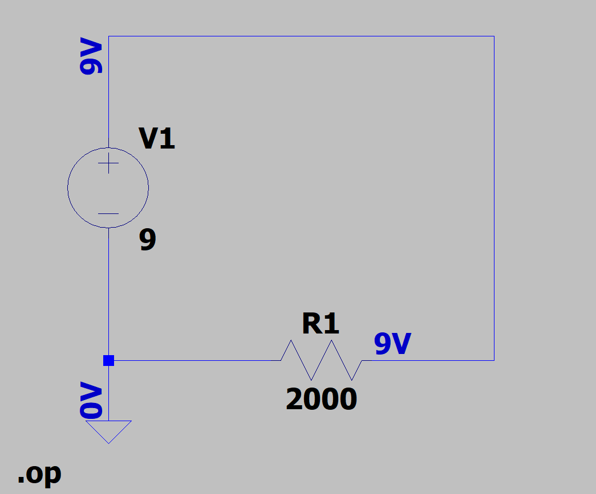
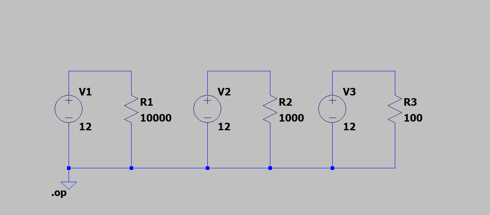
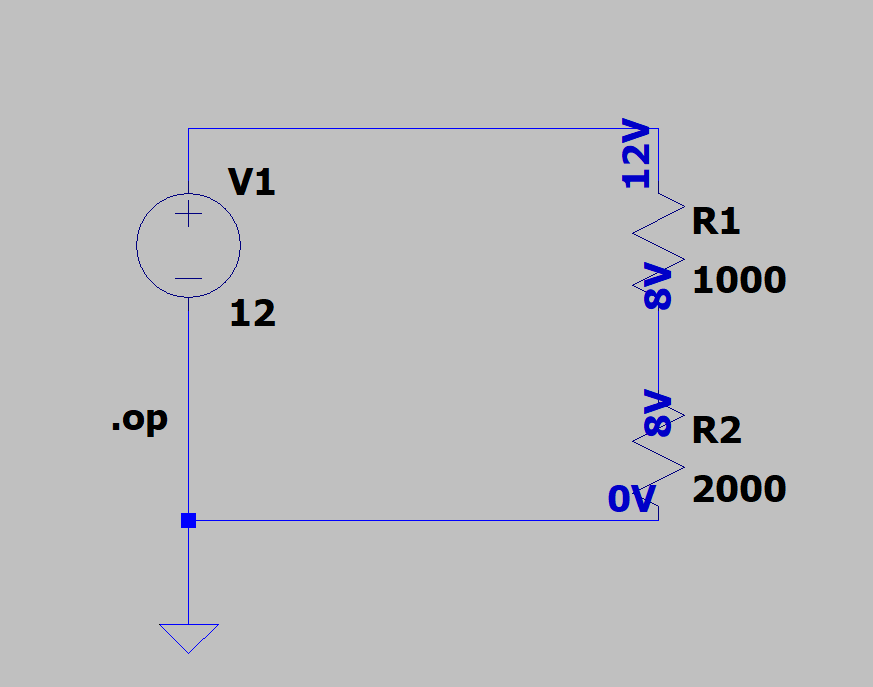
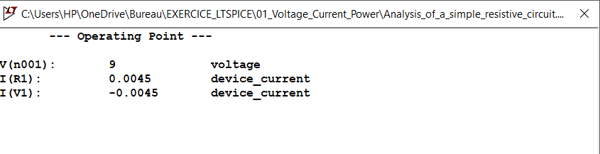
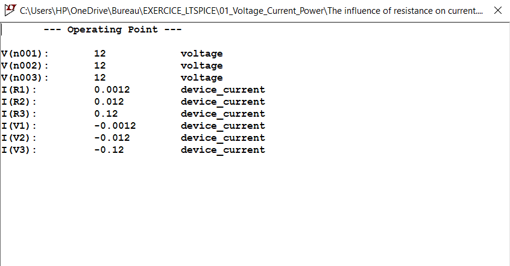
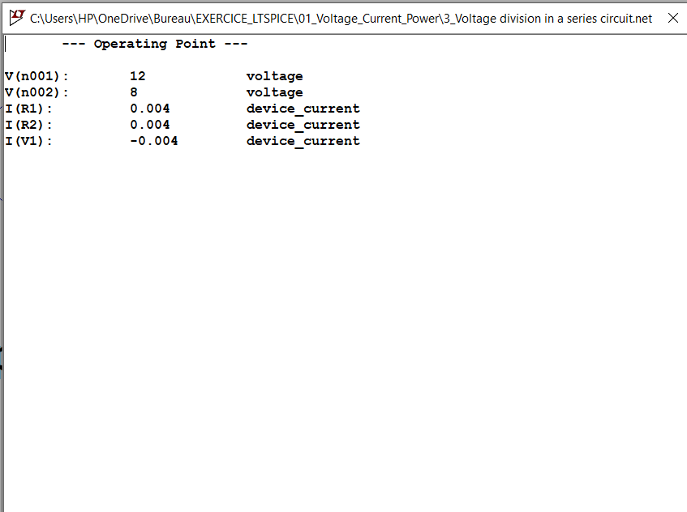

# Exercise 1, 2, 3: Ohm's Law & Power Dissipation

## 1. Objective
The purpose of these foundational exercises is to:
* Understand Ohm's law and the relationship between voltage, current, and resistance (EXERCISE 1)
* Understand the effect of resistance value on current and power dissipation (EXERCISE 2)
* Understand a series circuit (EXERCISE 3)

## 2. Circuit Schematic (LTspice)
EXERCISE 1

---
EXERCISE 2

---
EXERCISE 3

---

## 3. Theoretical Analysis

### EXERCISE 1
Using a DC voltage source of **9 V** and a resistor of **2000 $\Omega$**, the mathematical expectations are:
* Current ($I$): $I = \frac{V}{R} = \frac{9\text{ V}}{2000\ \Omega} = 4.5\text{ mA}$
* Power Dissipation ($P$): $P = V \cdot I = 9\text{ V} \cdot 0.0045\text{ A} = 40.5\text{ mW}$

---

### EXERCISE 2
Using a DC voltage source of **12 V** and multiple resistors (**R1 = 10 000 $\Omega$**, **R2 = 1000 $\Omega$**, **R3 = 100 $\Omega$**), the mathematical expectations are:
* Current ($I$): $I = \frac{V}{R} \rightarrow I_1 = 1.2\text{ mA}, I_2 = 12\text{ mA}, I_3 = 120\text{ mA}$
* Power Dissipation ($P$): $P = V \cdot I \rightarrow P_1 = 14.4\text{ mW}, P_2 = 144\text{ mW}, P_3 = 1440\text{ mW}$

---

### EXERCISE 3
Using a DC voltage source of **12 V** and two resistors (**R1 = 1000 $\Omega$**, **R2 = 2000 $\Omega$**), the mathematical expectations are:
* Equivalent resistance ($R_{eq}$): $R_{eq} = R_1 + R_2 = 3000\ \Omega$
* Current ($I$): $I = \frac{V}{R_{eq}} = \frac{12\text{ V}}{3000\ \Omega} = 4\text{ mA}$
* Voltage ($V$): $V = R \cdot I \rightarrow V_1 = 4\text{ V}, V_2 = 8\text{ V}$
* Power Dissipation ($P$): $P = V \cdot I \rightarrow P_1 = 16\text{ mW}, P_2 = 32\text{ mW}$
    
## 4. Simulation Results & Comparison

The circuit was simulated using the operating point directive (`.op`) in LTspice.

### EXERCISE 1

| Electrical Parameter | Theoretical Value | Simulated Value | Discrepancy (%) |
| :--- | :---: | :---: | :---: |
| Loop Current ($I$) | 4.5 mA | 4.5 mA | 0% |
| Power Dissipation ($P$) | 40.5 mW | 40.499998 mW | 0% |

### EXERCISE 2

| Electrical Parameter | Theoretical Value | Simulated Value | Discrepancy (%) |
| :--- | :---: | :---: | :---: |
| Loop Current ($I$) | 1.2 mA ; 12 mA ; 120 mA | 1.2 mA ; 12 mA ; 120 mA | 0% |
| Power Dissipation ($P$) | 14.4 mW ; 144 mW ; 1440 mW | 14.4 mW ; 144 mW ; 1440 mW | 0% |

### EXERCISE 3

| Electrical Parameter | Theoretical Value | Simulated Value | Discrepancy (%) |
| :--- | :---: | :---: | :---: |
| Loop Current ($I$) | 4 mA | 4 mA | 0% |
| Power Dissipation ($P$) | 16 mW ; 32 mW | 16 mW ; 32 mW | 0% |
| Voltage ($V$) | 4 V ; 8 V | 4 V ; 8 V | 0% |

## 5. Technical Insights

* **Resistance and Power (EXERCISE 1 & 2):** Resistance limits electric current by opposing the movement of electric charges. Under constant voltage, decreasing the resistance increases the current, which in turn increases the power dissipated via Joule heating. A voltage source always needs a load to limit the current, otherwise a short circuit will occur.
* **Series Circuit Principles (EXERCISE 3):** In a series circuit, the same current flows through all components because there is only a single path for the movement of electric charges. The voltages across the resistors are different because each resistor causes a voltage drop that is proportional to its resistance.
